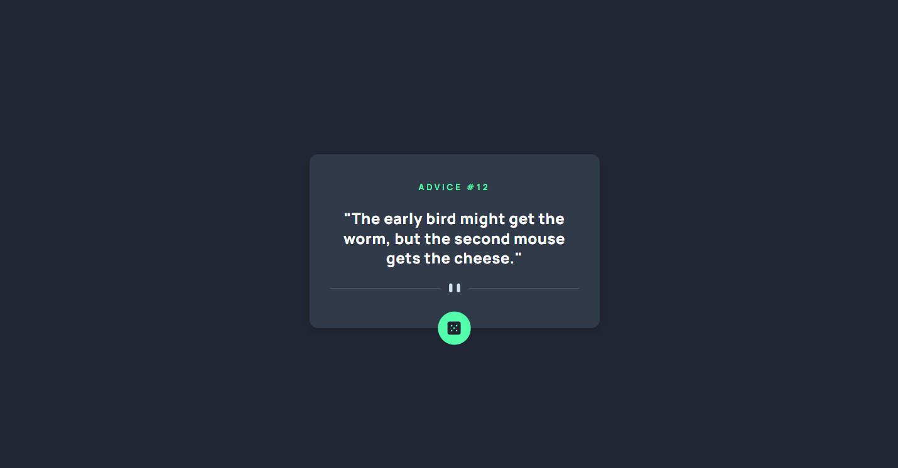

# Advice Card App

A simple React application that displays random advice in a card and includes a button to fetch new advice.

## Features

- Displays a random piece of advice from the provided list.
- Updates the advice when the "Get New Advice" button is clicked.
- Visual effect on the button shadow when hovered.

## Technologies Used

- React
- CSS (using CSS modules to manage component styles)
- JSON (for storing advice data)

## Project Structure

- `public/`: Contains static files such as the application icon and main HTML file.
- `src/`: Contains the source code of the application.
- `components/`: Contains React components of the application.
- `assets/`: Contains files like images or JSON data used by the application.
- `App.jsx`: Main component of the application.
- `main.jsx`: Entry point for rendering the React application.
- `README.md`: This file! Contains instructions for installation, running, and other useful information.

