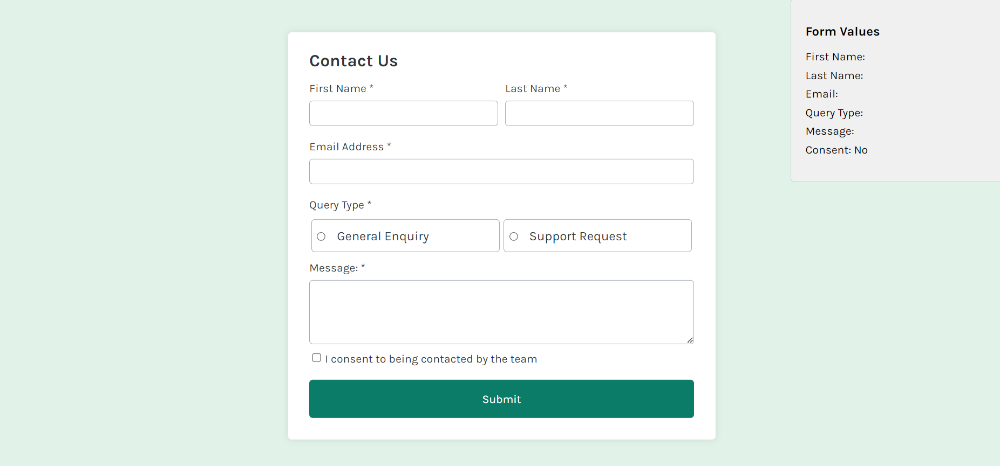

# Contact Form React App

This is a simple React application that allows users to fill out a contact form. The form includes fields for first name, last name, email address, query type, message, and consent checkbox. As the user inputs data into the form fields, the sidebar displays the entered values in real-time.

## Features

- **First Name**: Input field for user's first name.
- **Last Name**: Input field for user's last name.
- **Email Address**: Input field for user's email address.
- **Query Type**: Radio buttons for selecting the type of query (General Enquiry or Support Request).
- **Message**: Textarea for entering the message.
- **Consent Checkbox**: Checkbox to consent to being contacted by the team.

## Usage

1. **Input Fields**: Fill out the required input fields (First Name, Last Name, Email Address, Query Type, Message).
2. **Consent Checkbox**: Check the consent checkbox if you agree to being contacted.
3. **Sidebar Display**: As you type in the form fields, the sidebar on the right displays the entered values in real-time.

## Logic

The `Form` component renders a contact form and manages its state using React hooks. It includes input fields for first name, last name, email, query type, a message textarea, and a consent checkbox. The form values are displayed in real-time in a `Sidebar` component.

1. **Import statements:** The code imports necessary React components and styles from other files.
2. **`Form` component:** This is the main component that renders the form.
3. **`useState` hook:** The `useState` hook is used to initialize the `formValues` state object, which holds the values of all form fields.
4. **`handleInputChange` function:** This function is called whenever an input field changes. It updates the corresponding value in the `formValues` state object based on the input's `id`, `value`, `type`, `checked`, and `name` properties.
5. **`handleSubmit` function:** This function is called when the form is submitted. It prevents the default form submission behavior and logs the current `formValues` state object to the console.
6. **JSX code:** The JSX code inside the `return` statement renders the form with various input fields, labels, and styling. The `onChange` event handler for each input field is set to the `handleInputChange` function.
7. **`Sidebar` component:** The `Form` component also renders the `Sidebar` component, passing the `formValues` state object as a prop.

### `handleInputChange` function

The `handleInputChange` function in this code is responsible for handling changes in form input fields. It is called whenever a form field's value changes, such as when a user types in a text input or selects a radio button.

Here's the purpose of the `handleInputChange` function:

1. **Updating Form State:** The function extracts the necessary information from the event object (`event.target`) to determine the input field's `id`, `value`, `type`, `checked`, and `name` properties.
2. **Handling Checkbox Inputs:** If the input field is a checkbox, the function sets the new value based on the `checked` property.
3. **Handling Radio Inputs:** If the input field is a radio button, the function checks if it is checked (`checked === true`). If it is, the function updates the corresponding value in the `formValues` state object.
4. **Updating State Object:** For all other input fields (text, email, textarea), the function updates the corresponding value in the `formValues` state object.
5. **State Update:** The function uses the `setFormValues` function provided by the `useState` hook to update the `formValues` state object with the new values.

In summary, the `handleInputChange` function is responsible for updating the `formValues` state object whenever a form field changes, ensuring that the form's state is always in sync with the user's input.

### `handleSubmit` function

When the user submits the form, the following events occur:

1. **The `handleSubmit` function is called.**
2. **The `event.preventDefault()` method is called** to prevent the default form submission behavior, which would cause the page to reload.
3. **The current `formValues` state object is logged to the console.** This can be useful for debugging or displaying the form data to the user.
4. **Additional form data processing logic can be added** inside the `handleSubmit` function. For example, you could send the form data to a server using an HTTP request.
5. **The `Form` component is re-rendered.** Since the `formValues` state object has not changed, the form will display the same values as before submission.
6. **The `Sidebar` component is also re-rendered,** and it will receive the updated `formValues` state object as a prop.

In summary, when the user submits the form, the `handleSubmit` function is called, and the form data is processed. The `Form` and `Sidebar` components are re-rendered, and the form values are displayed as before submission.

### `Sidebar` component

The `Sidebar` component in this code is used to display additional information or functionality related to the form. It is imported from the `./Sidebar` file.

The purpose of the `Sidebar` component could be various, such as:

1. **Displaying a summary of the form data.**
2. **Offering a preview of the form's output or results.**

The `Sidebar` component is rendered alongside the `Form` component. The `formValues` state object is passed as a prop to the `Sidebar` component, allowing it to access and display the form data.

The `Sidebar` component is not directly related to the form's state management or input handling. It is a separate component that can be customized and integrated into the application as needed.
