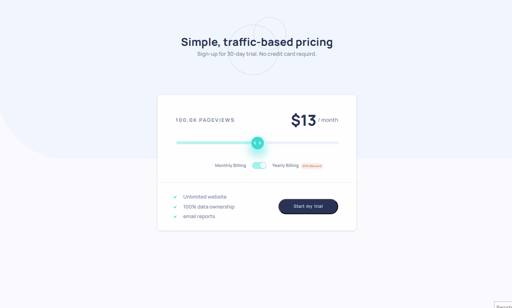

# Traffic-Based Pricing Application

## Overview

This application provides a simple, traffic-based pricing model with a slider and toggle switch for monthly and yearly billing. Users can adjust the slider to set the number of page views, and the pricing updates accordingly. The application includes a 25% discount for yearly billing, visually indicated by a custom switch and a discount badge.

## Table of Contents

- [Demo](#demo)
- [Features](#features)
- [Technologies Used](#technologies-used)
- [Usage](#usage)
- [Code Structure](#code-structure)
- [Components and Logic](#components-and-logic)
  - [App Component](app-component)
  - [RangerSlider Component](ranger-slider-component)
  - [Switch Component](switch-component)
- [Acknowledgements](#acknowledgements)

## Demo



## Features

- Dynamic pricing based on page views.
- Monthly and yearly billing options with a 25% discount for yearly billing.
- Custom styled slider and toggle switch.
- Responsive design.

## Technologies Used

- Vite
- React
- JavaScript ES6
- HTML5
- CSS

## Usage

1.  Adjust the slider to change the number of page views.
2.  Toggle between monthly and yearly billing using the switch.
3.  The price updates dynamically based on the input values.

## Components and Logic

In this chapter, we will explore the core components and their associated logic that form the backbone of our application. These components are designed to provide a dynamic and interactive user experience, leveraging the power of React for state management and UI updates. Each component encapsulates specific functionality, making the overall codebase modular and maintainable.

We will delve into the following components:

1. **App Component**: The main entry point of the application, managing overall state and rendering the primary UI elements.
2. **Switch Component**: A customizable switch UI element used to toggle settings.
3. **RangeSlider Component**: A flexible range slider for selecting values within a specified range.

The detailed documentation of each component will include their props, internal logic, and rendering approach, providing a comprehensive understanding of their roles and implementations in the application.

### App Component

The `App` component is the main component that holds the state and logic for the application.

This component is the main entry point for the application. It manages the state of the application, including the switch value, slider value, and calculation result.

```jsx
import { useState } from "react";
import "./App.css";
import Switch from "./components/Switch";
import RangeSlider from "./components/RangeSlider";

function App() {
  const [value, setValue] = useState(false);
  const [sliderValue, setSliderValue] = useState(100000);
  const [calculationResult, setCalculationResult] = useState(12.99);

  const handleSliderChange = (value) => {
    setSliderValue(value);
    const result = performCalculation(value);
    setCalculationResult(result);
  };

  const performCalculation = (sliderValue) => {
    const baseCostPerView = 0.00013;
    const discountedCostPerView = baseCostPerView * 0.75; // Sconto del 25%
    const costPerView = value ? discountedCostPerView : baseCostPerView;
    const result = sliderValue * costPerView;
    return parseFloat(result.toFixed(2));
  };

  const handleToggle = () => {
    const newValue = !value;
    setValue(newValue);
    const result = performCalculation(sliderValue);
    setCalculationResult(result);
  };

  const abbreviateNumber = (number) => {
    if (number >= 1000) {
      return (number / 1000).toFixed(1) + "K PAGEVIEWS";
    }
    return number.toString();
  };

  const sliderPercentage = (sliderValue / 200000) * 100;
  const sliderStyle = {
    background: `linear-gradient(90deg, var(--soft-cyan) ${sliderPercentage}%, var(--light-grayish-blue) ${sliderPercentage}%)`,
  };

  return (
    <>
      {/* Header START */}
      <div className="header-container">
        <h1>Simple, traffic-based pricing</h1>
        <p>Sign-up for 30-day trial. No credit card requird.</p>
      </div>
      {/* Header END */}
      <div className="app">
        {/* Results Start */}
        <div className="slider-container">
          {calculationResult !== null && (
            <div className="result">
              <div className="total">
                <p>/ month</p>
                <h2>${calculationResult}</h2>
              </div>
              <div className="views">
                <h3>{abbreviateNumber(sliderValue)}</h3>
              </div>
            </div>
          )}
          {/* Results End */}
          <RangeSlider
            min={0}
            max={200000}
            value={sliderValue}
            onChange={handleSliderChange}
            style={sliderStyle}
          />
        </div>
        {/* Switch Start */}
        <div className="switch-container">
          <p>Monthly Billing</p>
          <Switch isOn={value} handleToggle={handleToggle} />
          <p>
            Yearly Billing
            <span className="discount">25% discount</span>
          </p>
        </div>
        {/* Switch End */}
        <hr className="horizontal-line" />
        {/* Card-Footer Start */}
        <div className="card-footer">
          <div className="features">
            <ul className="features-list">
              <li>&nbsp;&nbsp;&nbsp;&nbsp;Unlimited website</li>
              <li>&nbsp;&nbsp;&nbsp;&nbsp;100% data ownership</li>
              <li>&nbsp;&nbsp;&nbsp;&nbsp;email reports</li>
            </ul>
          </div>
          <div className="start">
            <button>Start my trial</button>
          </div>
        </div>
        {/* Card-Footer End */}
      </div>
    </>
  );
}

export default App;
```

#### State Management

The component uses the `useState` hook to initialize the state variables:

- `value`: a boolean representing the switch value.
- `sliderValue`: a number representing the slider value.
- `calculationResult`: a number representing the calculated cost based on the switch and slider values.
  ####Main Functions
  The component defines three functions:

1. **handleSliderChange** - Updates the `sliderValue` state. - Calls the `performCalculation` function to update the `calculationResult`.
2. **performCalculation** - Calculates the cost per view based on the switch value and the slider value. - Applies a 25% discount if the switch is on.
3. **handleToggle** - Updates the `value` state. - Calls the `performCalculation` function to update the `calculationResult`.

#### Utility Function

The component also defines an `abbreviateNumber` function to format the number of page views.

#### Dynamic Styling

The component calculates the dynamic style for the slider background using the `sliderPercentage` and `sliderStyle` variables.

#### Rendering

The component renders the application UI, including the header, slider, switch, results, and card footer. The UI is built using HTML and CSS, and the state variables are used to update the UI dynamically.

### RangeSlider Component

This component represents the slider used for selecting the number of page views. This code is designed creates a reusable range slider component in React that can be easily customized with different props:

- `min`: to define the minimum value of the range.
- `max`: to define the maximum value of the range.
- `value`: to set the initial value of the slider.
- `onChange`: to handle the value change event.
- `style`: to apply custom styles to the slider.

```jsx
import React from "react";
import "./RangeSlider.css";

const RangeSlider = ({ min, max, value, onChange, style }) => {
  const onValueChanged = (event) => {
    const newValue = Number.parseInt(event.target.value, 10);
    onChange(newValue);
  };

  return (
    <input
      type="range"
      min={min}
      max={max}
      value={value}
      onChange={onValueChanged}
      className="custom-slider"
      style={style}
    />
  );
};

export default RangeSlider;
```

#### Helper Function

Inside the component, there's a helper function `onValueChanged` that:

- Parses the new value from the event target.
- Calls the `onChange` prop with the new value. This function is used as the `onChange` event handler for the range input.

#### Rendering

The component renders an `<input>` element with the type set to "range", passing the provided props (`min`, `max`, `value`, `onChange`, `className`, and `style`) to customize the slider. The `className` prop is set to "custom-slider" to apply CSS styles defined in the _RangeSlider.css_
file.

### Switch Component

This component represents the toggle switch for selecting between monthly and yearly billing and it's designed to render a customizable switch UI element.
It accepts two props:

- `isOn`: a boolean indicating the switch's state.
- `handleToggle`: a function to be called when the switch is toggled.

```jsx
import React from "react";
import "./Switch.css";

const Switch = ({ isOn, handleToggle }) => {
  return (
    <>
      <input
        checked={isOn}
        onChange={handleToggle}
        className="switch-checkbox"
        id={`switch-new`}
        type="checkbox"
      />
      <label
        style={{ background: isOn && "var(--soft-cyan)" }}
        className="switch-label"
        htmlFor={`switch-new`}
      >
        <span className={`switch-button`} />
      </label>
    </>
  );
};

export default Switch;
```

#### Input Element

The component uses the `input` element with the type `checkbox` to create the switch's appearance:

- The `checked` attribute is bound to the `isOn` prop, so the switch will be checked when `isOn` is true.
- The `onChange` event is bound to the `handleToggle` prop, so the parent component can handle the switch's state change.

#### Label Element

The `label` element is used to wrap the switch's visual elements and provide a clickable area for toggling the switch:

- The `style` attribute dynamically changes the background color of the label when the switch is on.
- The `for` attribute is set to the same value as the `id` attribute of the `input` element, associating the label with the input.

#### Span Element

Inside the label, there is a `span` element with the class name `switch-button`:

- This element represents the button part of the switch and can be styled further to create a visually appealing switch.

#### Export

Finally the component is exported as the default export, allowing it to be imported and used in the App component.

## Acknowlegement

Design inspiration for this project was drawn from [frontendmentor.io](https://www.frontendmentor.io). Special thanks to the creators and community of Frontend Mentor for providing high-quality design challenges that help developers enhance their skills and create beautiful, user-friendly applications.
