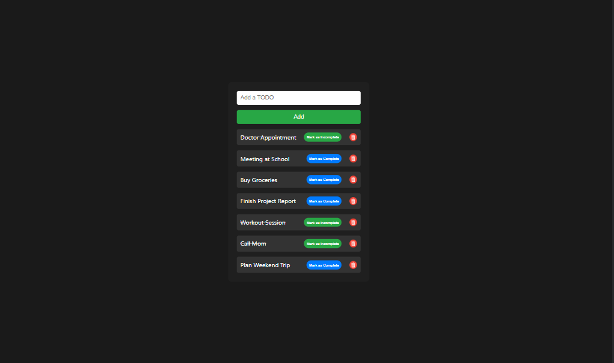

# Todo List App

This is a simple Todo List application built with React. It allows you to add, mark as complete/incomplete, and delete tasks. The user interface is styled using CSS modules.



## Table of Contents

- [Features](#features)
- [Installation](#installation)
- [Usage](#usage)
- [Code Overview](#code-overview)
  - [State Management](#state-management)
  - [Adding a Task](#adding-a-task)
  - [Deleting a Task](#deleting-a-task)
  - [Toggling Task Completion](#toggling-task-completion)
  - [Rendering the Tasks](#rendering-the-tasks)
- [Conclusion](#conclusion)
- [License](#license)

## Features

- **Add Tasks**: Users can add new tasks to the list.
- **Mark as Complete/Incomplete**: Users can mark tasks as complete or incomplete.
- **Delete Tasks**: Users can delete tasks from the list.

## Installation

1.  **Clone the repository**:

    ```bash
    git clone https://github.com/yourusername/todo-list-app.git
    cd todo-list-app
    ```

2.  **Install dependencies**:

    ```bash
    npm install
    ```

3.  **Start the application**:

```bash
npm start
```

## Usage

1.  **Add a Task**: Type a task in the input field and click the "Add" button.
2.  **Mark as Complete/Incomplete**: Click the "Mark as Complete" button next to a task to mark it as complete. Click "Mark as Incomplete" to mark it as incomplete.
3.  **Delete a Task**: Click the trash bin icon next to a task to delete it.

## Code Overview

### State Management

The application uses the `useState` hook to manage the state of tasks and the input field:

```jsx

const [tasks, setTasks] = useState([...]);
const [newTask, setNewTask] = useState("");
```

### Adding a Task

The `AddTask` function adds a new task to the list if the input is not empty:

```jsx
const AddTask = () => {
  if (newTask.trim() === "") return;

  const newTaskObject = {
    id: crypto.randomUUID(),
    text: newTask,
    completed: false,
  };
  setTasks([...tasks, newTaskObject]);
  setNewTask("");
};
```

### Deleting a Task

The `DeleteTask` function removes a task from the list based on its ID:

```jsx
const DeleteTask = (id) => {
  setTasks(tasks.filter((task) => task.id !== id));
};
```

### Toggling Task Completion

The `ToggleTaskCompletion` function toggles the completion status of a task:

```jsx
const ToggleTaskCompletion = (id) => {
  setTasks(
    tasks.map((task) =>
      task.id === id ? { ...task, completed: !task.completed } : task
    )
  );
};
```

### Rendering the Tasks

Tasks are rendered inside a `ul` element, and each task is displayed with its text, a "Done" button, and a "Delete" button:

```jsx
<ul>
  {tasks.map((task) => (
    <li key={task.id}>
      <span
        className={style.taskText}
        style={{
          textDecoration: task.completed ? "line-through" : "none",
        }}
      >
        {task.text}
      </span>
      <button
        className={`${style.doneButton} ${
          task.completed ? style.completed : style.incomplete
        }`}
        onClick={() => ToggleTaskCompletion(task.id)}
      >
        {task.completed ? "Mark as Incomplete" : "Mark as Complete"}
      </button>
      <button
        className={style.deleteButton}
        onClick={() => DeleteTask(task.id)}
      >
        
      </button>
    </li>
  ))}
</ul>
```

## Conclusion

This Todo List application is a simple yet effective example of managing state and rendering dynamic content with React. The use of CSS Modules ensures that the styles are encapsulated and modular.

Feel free to modify and extend the functionality as needed. Happy coding!

## License

This project is licensed under the MIT License. See the LICENSE file for details.
