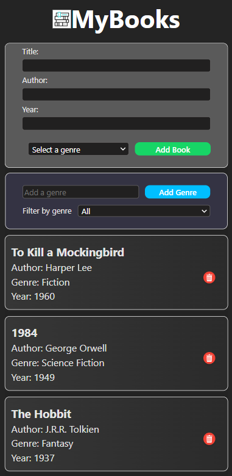

# Book Catalog App

This project is a simple book catalog application built using React. It allows users to add books with details such as title, author, genre, and year. Users can also filter books by genre and delete them from the catalog.



## Table of Contents

1.  [Installation](#installation)
2.  [Usage](#usage)
3.  [Components](#components)
    - [App Component](#app-component)
    - [BookForm Component](#bookform-component)
    - [BookList Component](#booklist-component)
    - [BookItem Component](#bookitem-component)
4.  [License](#license)

## Installation

To run this project locally, follow these steps:

1.  Clone the repository:

```bash
git clone <repository-url>
```

2.  Navigate into the project directory:

```bash
cd book-catalog-app
```

3.  Install dependencies:

```bash
npm install`
```

4.  Start the development server:

```bash
npm start
```

## Usage

### Adding a Book

1.  Fill out the book details (Title, Author, Genre, Year) in the form.
2.  Click on the "Add Book" button to add the book to the catalog.

### Filtering Books

- Use the dropdown menu to filter books by genre.

### Deleting a Book

- Click on the trash icon next to the book to delete it from the catalog.

## Components

### App Component

The main component that handles state management and renders the entire application.

```jsx
import { useState } from "react";
import BookForm from "./components/BookForm";
import BookList from "./components/BookList";
import style from "./App.module.css";

function App() {
  // State management
  const [books, setBooks] = useState([
    {
      id: crypto.randomUUID(),
      title: "To Kill a Mockingbird",
      author: "Harper Lee",
      genre: "Fiction",
      year: 1960,
    },
    // Additional book objects
  ]);

  const [genres, setGenres] = useState([
    "Fiction",
    "Non-Fiction",
    "Fantasy",
    "Science Fiction",
    "Mystery",
  ]);

  const [filter, setFilter] = useState("");
  const [newGenre, setNewGenre] = useState("");

  // Function to add a new book
  const addBook = (book) => {
    setBooks([...books, { ...book, id: crypto.randomUUID() }]);
  };

  // Function to delete a book
  const deleteBook = (id) => {
    setBooks(books.filter((book) => book.id !== id));
  };

  // Function to handle genre filter change
  const handleFilterChange = (e) => {
    setFilter(e.target.value);
  };

  // Function to handle new genre input change
  const handleNewGenreChange = (e) => {
    setNewGenre(e.target.value);
  };

  // Function to add a new genre
  const addGenre = () => {
    if (newGenre.trim() && !genres.includes(newGenre)) {
      setGenres([...genres, newGenre]);
      setNewGenre("");
    }
  };

  // Filtering books based on the selected genre
  const filteredBooks =
    filter === "" ? books : books.filter((book) => book.genre === filter);

  return (
    <div className={style.container}>
      <header>
        <h1>Book Catalog</h1>
      </header>
      <BookForm addBook={addBook} genres={genres} />
      <div className={style.filter}>
        <label htmlFor="genreFilter">Filter by Genre: </label>
        <select id="genreFilter" value={filter} onChange={handleFilterChange}>
          <option value="">All</option>
          {genres.map((genre) => (
            <option key={genre} value={genre}>
              {genre}
            </option>
          ))}
        </select>
        <div className={style.genre}>
          <input
            type="text"
            placeholder="Add a genre"
            value={newGenre}
            onChange={handleNewGenreChange}
          />
          <button className={style.genreButton} onClick={addGenre}>
            Add Genre
          </button>
        </div>
      </div>
      <BookList books={filteredBooks} deleteBook={deleteBook} />
    </div>
  );
}

export default App;`
```

#### State:

- **books**: Array of objects representing books in the catalog.
- **genres**: Array of strings representing available genres.
- **filter**: String representing the currently selected genre for filtering.
- **newGenre**: String representing the newly added genre from user input.

#### Functions:

- **addBook(book)**: Adds a new book to the catalog.
- **deleteBook(id)**: Deletes a book from the catalog based on its ID.
- **handleFilterChange(e)**: Updates the filter state based on user selection.
- **handleNewGenreChange(e)**: Updates the newGenre state based on user input.
- **addGenre()**: Adds a new genre to the genres array.

### BookForm Component

Responsible for rendering the form to add new books.

```jsx
import { useState } from "react";
import style from "./BookForm.module.css";

function BookForm({ addBook, genres }) {
  // State management for form inputs
  const [title, setTitle] = useState("");
  const [author, setAuthor] = useState("");
  const [genre, setGenre] = useState("");
  const [year, setYear] = useState("");

  // Function to handle form submission
  const handleSubmit = (e) => {
    e.preventDefault();

    // Check if title and author are provided
    if (!title || !author) {
      alert("Title and Author are required!");
      return;
    }

    // Invoke addBook function to add new book
    addBook({ title, author, genre, year });

    // Clear form inputs after submission
    setTitle("");
    setAuthor("");
    setGenre("");
    setYear("");
  };

  return (
    <form onSubmit={handleSubmit} className={style.bookForm}>
      {/* Input fields for book details */}
    </form>
  );
}

export default BookForm;
```

#### Props:

- **addBook**: Function to add a new book.
- **genres**: Array of strings representing available genres.

#### State:

- **title, author, genre, year**: Strings representing the input fields in the form.

#### Functions:

- **handleSubmit(e)**: Handles form submission and invokes addBook function.

### BookList Component

Renders the list of books based on the current filter.

```jsx
import BookItem from "./BookItem";
import style from "./BookList.module.css";

function BookList({ books, deleteBook }) {
  return (
    <ul className={style.list}>
      {books.map((book) => (
        <BookItem key={book.id} book={book} deleteBook={deleteBook} />
      ))}
    </ul>
  );
}

export default BookList;
```

#### Props:

- **books**: Array of objects representing books to display.
- **deleteBook**: Function to delete a book.

### BookItem Component

Represents a single book item in the list.

```jsx
import style from "./BookItem.module.css";
import deleteIcon from "../assets/bin.png";

function BookItem({ book, deleteBook }) {
  return (
    <li className={style.item}>
      <div className={style.details}>
        <h3>{book.title}</h3>
        {/* Display other book details */}
      </div>
      <button
        className={style.deleteButton}
        onClick={() => deleteBook(book.id)}
      >
        
      </button>
    </li>
  );
}

export default BookItem;
```

#### Props:

- **book**: Object representing the book details.
- **deleteBook**: Function to delete the book.

## License

This project is licensed under the MIT License - see the LICENSE file for details.
