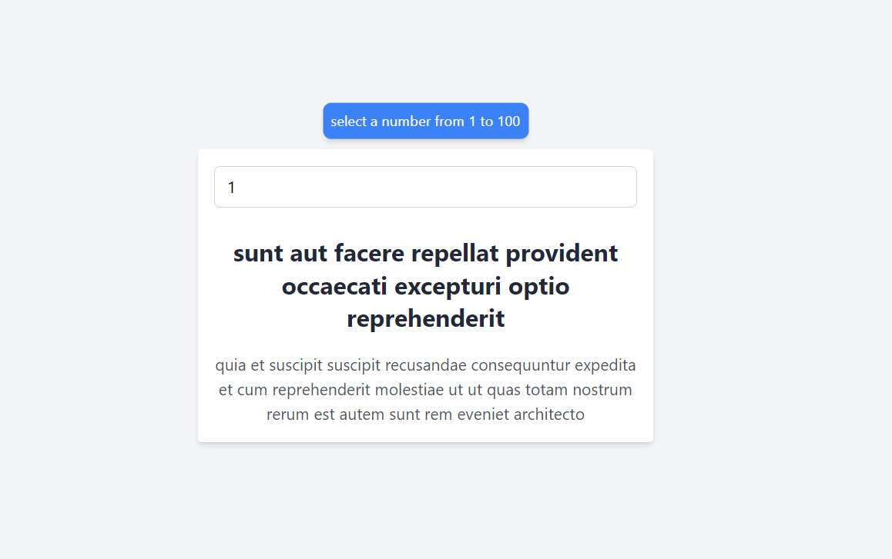

# Advice Generator

The project is a React application that allows users to select a number between 1 and 100 and displays the corresponding post title and body fetched from the [JSONPlaceholder](https://jsonplaceholder.typicode.com/posts) API.



## Technologies Used

- **React**: JavaScript library for building user interfaces.
- **Tailwind CSS**: CSS framework used for styling the application.
- **JSONPlaceholder API**: API used to retrieve post data.

## Key Features

- **Post ID Selection**: Users can input a number between 1 and 100 in an input field to select the corresponding post.
- **Data Fetching**: The `useEffect` hook is utilized to make API calls to JSONPlaceholder whenever the post ID changes.
- **Displaying Data**: The title and body of the selected post are displayed in the user interface.

## Components and Tailwind CSS Classes Used

### Components

- **App**: The main component that manages the post ID state and handles data fetching.

### Tailwind CSS Classes Used

- `flex`, `flex-col`, `items-center`, `justify-center`: For flexible and centered layout.
- `min-h-screen`, `bg-gray-100`: Settings for minimum height and background color.
- `w-full`, `max-w-md`, `p-4`, `bg-white`, `rounded`, `shadow-md`: Styles for the post container.
- `border`, `border-gray-300`, `rounded-md`, `focus:outline-none`, `focus:ring`, `focus:ring-blue-200`: Styles for the input field.
- `text-center`, `mt-4`, `text-2xl`, `font-bold`, `text-gray-800`, `mt-2`, `text-gray-600`: Text styles and formatting.

## Example Code

```jsx
import { useState, useEffect } from "react";
import "./App.css";

function App() {
  const [postId, setPostId] = useState(1);
  const [post, setPost] = useState({ title: "", body: "" });

  useEffect(() => {
    const fetchPost = async () => {
      try {
        const response = await fetch(
          `https://jsonplaceholder.typicode.com/posts/${postId}`
        );
        const data = await response.json();
        setPost({ title: data.title, body: data.body });
      } catch (error) {
        console.error("Error fetching post:", error);
      }
    };

    fetchPost();
  }, [postId]);

  const handleChange = (event) => {
    setPostId(event.target.value);
  };

  return (
    <div className="flex flex-col items-center justify-center min-h-screen bg-gray-100">
      <div className="flex flex-col justify-between items-center w-full max-w-md p-4 bg-white rounded shadow-md h-72">
        <input
          id="postId"
          type="number"
          value={postId}
          onChange={handleChange}
          min="1"
          max="100"
          placeholder="Select a number from 1 to 100"
          required
          className="w-full px-3 py-2 border border-gray-300 rounded-md focus:outline-none focus:ring focus:ring-blue-200"
        />
        <label
          htmlFor="post id"
          className="fixed top-1/2 left-1/2 transform -translate-x-1/2 -translate-y-[calc(40%+11rem)] shadow-md text-sm bg-blue-500 text-white p-2 rounded-lg"
        >
          Select a number from 1 to 100
        </label>
        <h2 className="text-center mt-4 text-2xl font-bold text-gray-800">
          {post.title}
        </h2>
        <p className="mt-2 text-gray-600 text-center">{post.body}</p>
      </div>
    </div>
  );
}

export default App;
```

## Understanding useEffect

The `useEffect` hook is crucial in this project for fetching data from the JSONPlaceholder API. It is used to perform side effects in functional components.

In this project:

- We define an effect that runs every time the `postId` state changes.
- Inside the effect, an asynchronous function `fetchPost` is defined to fetch data from the API endpoint corresponding to the current `postId`.
- Upon successful data retrieval, the `setPost` function updates the state with the fetched post title and body.

This ensures that whenever the user selects a different post ID, the application fetches and displays the corresponding post data dynamically.
