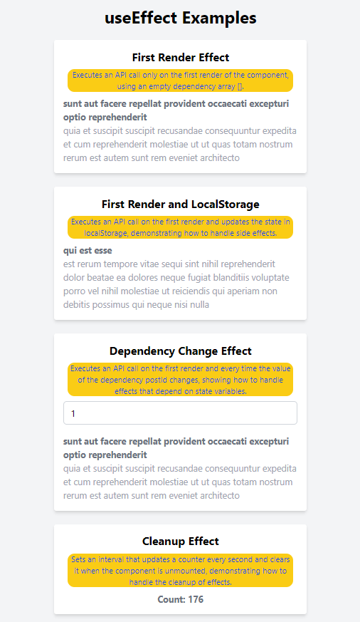

# useEffect Examples in React

This project demonstrates various use cases of the `useEffect` hook in React. Each example is implemented as a separate component, showcasing different scenarios and functionalities.



## FirstRenderEffect

Executes an API call only on the first render of the component, using an empty dependency array [].

```jsx
import React, { useEffect, useState } from "react";

function FirstRenderEffect() {
  const [data, setData] = useState(null);

  useEffect(() => {
    console.log("Fetching data on first render");
    fetch("https://jsonplaceholder.typicode.com/posts/1")
      .then((response) => response.json())
      .then((data) => setData(data));
  }, []);

  return (
    <div className="mb-6 p-4 bg-white rounded shadow-md w-full max-w-md">
      <h2 className="text-xl font-bold mb-2 text-center">
        First Render Effect
      </h2>
      <p className="text-blue-700 bg-yellow-400 text-center m-2 rounded-xl text-sm">
        Executes an API call only on the first render of the component, using an
        empty dependency array [].
      </p>

      {data ? (
        <div>
          <h3 className="font-bold text-gray-500">{data.title}</h3>
          <p className="text-gray-400">{data.body}</p>
        </div>
      ) : (
        <p>Loading...</p>
      )}
    </div>
  );
}

export default FirstRenderEffect;
```

## FirstRenderAndLocalStorage

Executes an API call on the first render and updates the state in localStorage, demonstrating how to handle side effects.

```jsx
import React, { useEffect, useState } from "react";

function FirstRenderAndLocalStorage() {
  const [data, setData] = useState(null);

  useEffect(() => {
    console.log("Fetching data and setting localStorage on first render");
    fetch("https://jsonplaceholder.typicode.com/posts/2")
      .then((response) => response.json())
      .then((data) => {
        setData(data);
        localStorage.setItem("post2", JSON.stringify(data));
      });
  }, []);

  return (
    <div className="mb-6 p-4 bg-white rounded shadow-md w-full max-w-md">
      <h2 className="text-xl font-bold mb-2 text-center">
        First Render and LocalStorage
      </h2>
      <p className="text-blue-700 bg-yellow-400 text-center m-2 rounded-xl text-sm">
        Executes an API call on the first render and updates the state in
        localStorage, demonstrating how to handle side effects.
      </p>
      {data ? (
        <div>
          <h3 className="font-bold text-gray-500">{data.title}</h3>
          <p className="text-gray-400">{data.body}</p>
        </div>
      ) : (
        <p>Loading...</p>
      )}
    </div>
  );
}

export default FirstRenderAndLocalStorage;
```

## DependencyChangeEffect

Executes an API call on the first render and every time the value of the dependency postId changes, showing how to handle effects that depend on state variables.

```jsx
import React, { useEffect, useState } from "react";

function DependencyChangeEffect() {
  const [postId, setPostId] = useState(1);
  const [data, setData] = useState(null);

  useEffect(() => {
    console.log(`Fetching data for post ${postId}`);
    fetch(`https://jsonplaceholder.typicode.com/posts/${postId}`)
      .then((response) => response.json())
      .then((data) => setData(data));
  }, [postId]);

  return (
    <div className="mb-6 p-4 bg-white rounded shadow-md w-full max-w-md">
      <h2 className="text-xl font-bold mb-2 text-center">
        Dependency Change Effect
      </h2>
      <p className="text-blue-700 bg-yellow-400 text-center m-2 rounded-xl text-sm">
        Executes an API call on the first render and every time the value of the
        dependency postId changes, showing how to handle effects that depend on
        state variables.
      </p>
      <input
        type="number"
        value={postId}
        onChange={(e) => setPostId(e.target.value)}
        min="1"
        max="100"
        className="w-full px-3 py-2 border border-gray-300 rounded-md mb-4"
      />
      {data ? (
        <div>
          <h3 className="font-bold text-gray-500">{data.title}</h3>
          <p className="text-gray-400">{data.body}</p>
        </div>
      ) : (
        <p>Loading...</p>
      )}
    </div>
  );
}

export default DependencyChangeEffect;
```

## CleanupEffect

Sets an interval that updates a counter every second and clears it when the component is unmounted, demonstrating how to handle the cleanup of effects.

```jsx
import React, { useEffect, useState } from "react";

function CleanupEffect() {
  const [count, setCount] = useState(0);

  useEffect(() => {
    const interval = setInterval(() => {
      setCount((prevCount) => prevCount + 1);
    }, 1000);

    return () => {
      console.log("Cleaning up interval");
      clearInterval(interval);
    };
  }, []);

  return (
    <div className="mb-6 p-4 bg-white rounded shadow-md w-full max-w-md">
      <h2 className="text-xl font-bold mb-2 text-center">Cleanup Effect</h2>
      <p className="text-blue-700 bg-yellow-400 text-center m-2 rounded-xl text-sm">
        Sets an interval that updates a counter every second and clears it when
        the component is unmounted, demonstrating how to handle the cleanup of
        effects.
      </p>
      <p className="font-bold text-gray-500 text-center">Count: {count}</p>
    </div>
  );
}

export default CleanupEffect;
```

### Conclusion

This series of examples covers various use cases of `useEffect`, providing a solid foundation for understanding how and when to use this hook in a React application. Use these examples to further explore the possibilities of `useEffect` and adapt them to your specific needs.
