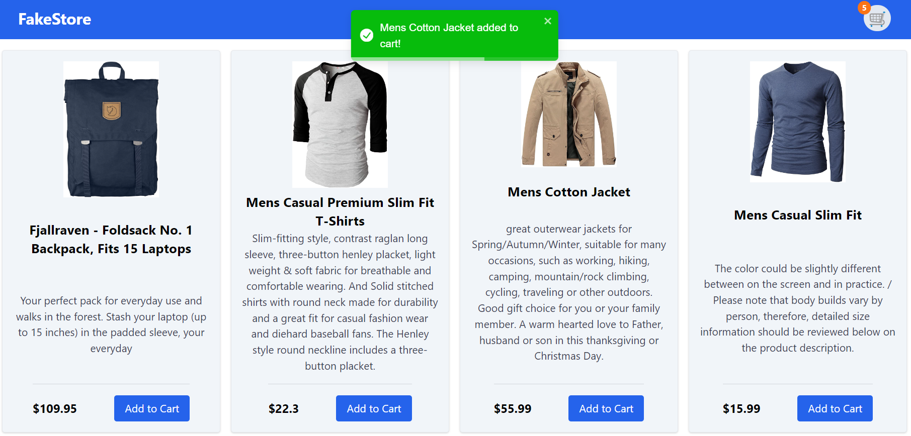

# FakeStore

FakeStore is an e-commerce web application built using modern web technologies. The app provides features for browsing products, managing a shopping cart, viewing product details, and receiving notifications.

## Technologies Used

- **React.js** for the front-end framework.
- **React Router** for navigation and routing.
- **Tailwind CSS** for styling.
- **React Toastify** for user notifications.
- **Context API** For state management related to the cart.



## Features

- **Product Browsing**: View a grid of products fetched from an external API.
- **Shopping Cart**: Add products to the cart and view/manage them.
- **Product Details**: View detailed information about a specific product and navigate to previous or next product details.
- **Notifications**: Get informed via toast notifications when actions like adding to the cart are performed.
- **Error Handling**: Display user-friendly error messages for route errors.

## Table of Contents

1.  [Components](#components)
    - [Main.jsx](#mainjsx)
    - [Layout.jsx](#layoutjsx)
    - [Cart.jsx](#cartjsx)
    - [ProductDetail.jsx](#productdetailjsx)
    - [CartContext.jsx](#cartcontextjsx)
    - [ErrorPage.jsx](#errorpagejsx)
2.  [Conclusion](#conclusion)

## Components

### Main.jsx

This is the entry point of the application, where routing is defined and the application is rendered.

```jsx
import React from "react";
import ReactDOM from "react-dom/client";
import { createBrowserRouter, RouterProvider } from "react-router-dom";
import Layout from "./components/Layout";
import Home from "./components/Home";
import Cart from "./components/Cart";
import ProductDetail from "./components/ProductDetail";
import ErrorPage from "./components/ErrorPage";
import { CartProvider } from "./CartContext";
import { ToastContainer } from "react-toastify";
import "react-toastify/dist/ReactToastify.css";
import "./index.css";

const router = createBrowserRouter([
  {
    path: "/",
    element: <Layout />,
    errorElement: <ErrorPage />,
    children: [
      {
        index: true,
        element: <Home />,
      },
      {
        path: "cart",
        element: <Cart />,
      },
      {
        path: "product/:productId",
        element: <ProductDetail />,
      },
    ],
  },
]);

ReactDOM.createRoot(document.getElementById("root")).render(
  <React.StrictMode>
    <CartProvider>
      <RouterProvider router={router} />
      <ToastContainer
        position="top-center"
        autoClose={3000}
        hideProgressBar={false}
        newestOnTop={false}
        closeOnClick
        rtl={false}
        pauseOnFocusLoss
        draggable
        pauseOnHover
        theme="colored"
      />
    </CartProvider>
  </React.StrictMode>
);
```

**Explanation:**

- **Imports**: Includes core React and ReactDOM libraries, React Router for routing, and context provider and toast notifications.
- **Router Creation**: Configures routing using `createBrowserRouter` with paths for home, cart, and product details.
- **Rendering**: Renders the React application with routing and global notifications.

### Layout.jsx

Defines the main structure of the application, including the header and the placeholder for child components.

```jsx
import { NavLink, Outlet } from "react-router-dom";
import { useContext } from "react";
import { CartContext } from "../CartContext";

const Layout = () => {
  const { cart } = useContext(CartContext);
  const cartItemCount = cart.length;

  return (
    <div className="min-h-screen flex flex-col">
      <header className="bg-blue-600 p-4 text-white flex items-center justify-between">
        <NavLink
          to="/"
          className={({ isActive }) =>
            isActive ? "text-2xl pl-6 font-bold" : "text-2xl pl-6"
          }
        >
          FakeStore
        </NavLink>
        <div className="relative">
          <NavLink
            to="/cart"
            className={({ isActive }) =>
              isActive
                ? "text-2xl bg-green-100 rounded-full p-1 mr-6 border-2 border-orange-500"
                : "text-2xl bg-slate-200 rounded-full p-1 mr-6"
            }
          >
            🛒
          </NavLink>
          {cartItemCount > 0 && (
            <span className="absolute top-0 right-16 inline-flex items-center justify-center w-5 h-5 text-xs font-bold leading-none text-white bg-orange-500 rounded-full transform translate-x-1/2 -translate-y-1/2">
              {cartItemCount}
            </span>
          )}
        </div>
      </header>
      <main className="flex-grow p-4">
        <Outlet />
      </main>
    </div>
  );
};

export default Layout;
```

**Explanation:**

- **Imports**: Uses `NavLink` for navigation and `Outlet` for rendering nested routes. Uses `CartContext` to get the cart state.
- **Layout Component**:
  - **Header**: Contains links to home and cart, with conditional styling based on active route. Displays the cart item count if there are items in the cart.
  - **Main**: Serves as a placeholder for child routes.

### Cart.jsx

Displays a list of products currently in the cart and allows users to remove items.

```jsx
import React, { useContext } from "react";
import { CartContext } from "../CartContext";

const Cart = () => {
  const { cart, removeFromCart } = useContext(CartContext);

  return (
    <div>
      <h2 className="text-2xl text-center mb-4">Your Cart</h2>
      {cart.length === 0 ? (
        <p className="text-xl text-center m-60">Your cart is empty</p>
      ) : (
        <div className="grid grid-cols-1 sm:grid-cols-2 lg:grid-cols-3 gap-4">
          {cart.map((product, index) => (
            <div
              key={index}
              className="border p-4 rounded shadow flex flex-col"
            >
              
              <div className="flex-grow">
                <h2 className="text-xl mt-2">{product.title}</h2>
              </div>
              <div className="flex justify-between mt-2">
                <p className="text-lg font-bold">${product.price}</p>
                <button
                  onClick={() => removeFromCart(index)}
                  className="bg-red-600 text-white px-4 py-2 rounded"
                >
                  Remove
                </button>
              </div>
            </div>
          ))}
        </div>
      )}
    </div>
  );
};

export default Cart;
```

**Explanation:**

- **Imports**: Uses `CartContext` to manage cart state.
- **Cart Component**:
  - **Display**: Shows cart items or a message if empty.
  - **Remove**: Allows users to remove items from the cart.

### ProductDetail.jsx

Displays detailed information about a specific product and allows navigation to previous or next product details.

```jsx
import { useState, useEffect, useContext } from "react";
import { useParams, useNavigate } from "react-router-dom";
import { toast } from "react-toastify";
import { CartContext } from "../CartContext";

const ProductDetail = () => {
  const { productId } = useParams();
  const [product, setProduct] = useState(null);
  const [products, setProducts] = useState([]);
  const navigate = useNavigate();
  const { addToCart } = useContext(CartContext);

  useEffect(() => {
    fetch(`https://fakestoreapi.com/products/${productId}`)
      .then((res) => res.json())
      .then((data) => setProduct(data));
  }, [productId]);

  useEffect(() => {
    fetch("https://fakestoreapi.com/products")
      .then((res) => res.json())
      .then((data) => setProducts(data));
  }, []);

  const handleAddToCart = (product) => {
    addToCart(product);
    toast.success(`${product.title} added to cart!`, {
      position: "top-center",
    });
  };

  if (!product) {
    return <div>Loading...</div>;
  }

  const currentIndex = products.findIndex((p) => p.id === parseInt(productId));
  const prevProduct = currentIndex > 0 ? products[currentIndex - 1] : null;
  const nextProduct =
    currentIndex < products.length - 1 ? products[currentIndex + 1] : null;

  return (
    <div className="p-4">
      <div className="border p-4 rounded shadow flex flex-col items-center px-80 bg-slate-100">
        
        <h2 className="text-3xl font-bold mt-4">{product.title}</h2>
        <p className="text-lg mt-2">${product.price}</p>
        <button
          onClick={() => handleAddToCart(product)}
          className="bg-green-600 text-white px-4 py-2 rounded mt-4"
        >
          Add to Cart
        </button>
        <p className="text-lg mt-4">{product.description}</p>
        <div className="flex mt-4">
          {prevProduct && (
            <button
              onClick={() => navigate(`/product/${prevProduct.id}`)}
              className="bg-blue-600 text-white px-4 py-2 rounded mr-2"
            >
              Previous
            </button>
          )}
          {nextProduct && (
            <button
              onClick={() => navigate(`/product/${nextProduct.id}`)}
              className="bg-blue-600 text-white px-4 py-2 rounded"
            >
              Next
            </button>
          )}
        </div>
      </div>
    </div>
  );
};

export default ProductDetail;
```

**Explanation:**

- **Imports**: Uses `useParams` to get the product ID, `useNavigate` for navigation, and `CartContext` for cart management.
- **ProductDetail Component**:
  - **Fetch Product**: Retrieves product details based on the ID from the URL.
  - **Handle Add to Cart**: Adds the product to the cart and shows a toast notification.
  - **Navigation**: Provides buttons to navigate to the previous and next product details.

### CartContext.jsx

Manages cart state using React's Context API.

```jsx
import { createContext, useState } from "react";

export const CartContext = createContext();

export const CartProvider = ({ children }) => {
  const [cart, setCart] = useState([]);

  const addToCart = (product) => {
    setCart((prevCart) => [...prevCart, product]);
  };

  const removeFromCart = (index) => {
    setCart((prevCart) => prevCart.filter((_, i) => i !== index));
  };

  return (
    <CartContext.Provider value={{ cart, addToCart, removeFromCart }}>
      {children}
    </CartContext.Provider>
  );
};
```

**Explanation:**

- **Context Creation**: `CartContext` is created to manage cart state across the application.
- **CartProvider**:
  - **State Management**: `addToCart` adds a product to the cart, and `removeFromCart` removes a product based on its index.

### ErrorPage.jsx

Displays an error message for unknown routes.

```jsx
import { useNavigate } from "react-router-dom";

const ErrorPage = () => {
  const navigate = useNavigate();

  return (
    <div className="text-center mt-20">
      <h1 className="text-4xl font-bold">404 - Page Not Found</h1>
      <p className="text-xl mt-4">
        The page you are looking for does not exist.
      </p>
      <button
        onClick={() => navigate("/")}
        className="mt-8 bg-blue-600 text-white px-4 py-2 rounded"
      >
        Go to Home
      </button>
    </div>
  );
};

export default ErrorPage;
```

**Explanation:**

- **ErrorPage Component**: Displays a 404 error message and provides a button to navigate back to the home page.

## Conclusion

The **FakeStore** application showcases a variety of features including product browsing, cart management, and notifications. With a clean and responsive design provided by Tailwind CSS, it offers a seamless user experience. The use of React's Context API for state management and React Router for navigation ensures that the application remains scalable and maintainable.

### Key Takeaways:

- **Component Structure**: The interaction between components like Layout, Home, Cart, ProductDetail, and ErrorPage creates a seamless user experience.
- **State Management**: The use of `useState` and `useEffect` hooks for managing local state and interacting with `localStorage` for persistent data storage.
- **Error Handling**: Handling route errors gracefully using `useRouteError` from React Router and providing a fallback page to guide users.

This application serves as a solid foundation for more advanced e-commerce features and showcases effective frontend development practices.
