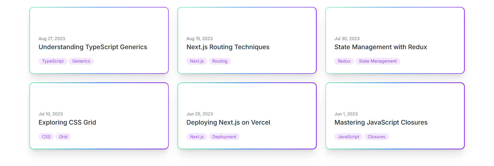

# Static Cards Page with Next.js and TypeScript

This repository contains a simple static webpage built with Next.js, TypeScript, and Tailwind CSS. The page displays a collection of animated cards, each representing an article with a title, publication date, and tags.

## Table of Contents

- [Features](#features)
- [Technologies Used](#technologies-used)
- [Project Structure](#project-structure)
- [Code Explanation](#code-explanation)
  - [ICard Interface](#icard-interface)
  - [Card Component](#card-component)
  - [Main Page Component](#main-page-component)
- [Tailwind CSS Configuration in TypeScript](#tailwind-css-configuration-in-typescript)

## Preview



## Features

- **Static Rendering**: The webpage is statically rendered using Next.js.
- **TypeScript Support**: TypeScript is used for type safety and better developer experience.
- **Reusable Components**: A reusable `Card` component is used to display each card.
- **Responsive Design**: Tailwind CSS is used for responsive and modern design.
- **Custom Animations**: Tailwind CSS is extended with custom animations for card hover effects.

## Technologies Used

- **Next.js**: A React framework that enables server-side rendering and static site generation.
- **TypeScript**: A statically typed superset of JavaScript.
- **Tailwind CSS**: A utility-first CSS framework for rapid UI development.

## Code Explanation

### ICard Interface

The `ICard` interface defines the structure of the card objects used in the project. This interface ensures type safety when passing card data to components.

```ts
//types.ts
export interface ICard {
  date: string;
  title: string;
  tags: string[];
}
```

- **date**: A string representing the publication date.
- **title**: A string containing the title of the card/article.
- **tags**: An array of strings representing tags associated with the article.

### Card Component

The `Card` component is a reusable component that receives an object conforming to the `ICard` interface as a prop and renders the card UI.

```ts
// components/Card.tsx
import { FC } from "react";
import { ICard } from "../types";

interface CardProps {
  card: ICard;
}

const Card: FC<CardProps> = ({ card }) => {
  return (
    <article className="hover:animate-background rounded-xl bg-gradient-to-r from-green-300 via-blue-500 to-purple-600 p-0.5 shadow-xl transition hover:bg-[length:400%_400%] hover:shadow-sm hover:[animation-duration:_4s]">
      <div className="rounded-[10px] bg-white p-4 !pt-20 sm:p-6">
        <time dateTime={card.date} className="block text-xs text-gray-500">
          {new Date(card.date).toLocaleDateString("en-US", {
            day: "numeric",
            month: "short",
            year: "numeric",
          })}
        </time>

        <a href="#">
          <h3 className="mt-0.5 text-lg font-medium text-gray-900">
            {card.title}
          </h3>
        </a>

        <div className="mt-4 flex flex-wrap gap-1">
          {card.tags.map((tag, index) => (
            <span
              key={index}
              className="whitespace-nowrap rounded-full bg-purple-100 px-2.5 py-0.5 text-xs text-purple-600"
            >
              {tag}
            </span>
          ))}
        </div>
      </div>
    </article>
  );
};

export default Card;
```

### Main Page Component

The `index.tsx` file represents the main page of the application. It imports the `Card` component and renders a grid of cards by iterating over an array of `ICard` objects.

```ts
// app/page.tsx
import Card from "../components/Card";
import { ICard } from "../types";

const cards: ICard[] = [
  {
    date: "2023-08-27",
    title: "Understanding TypeScript Generics",
    tags: ["TypeScript", "Generics"],
  },
  {
    date: "2023-08-15",
    title: "Next.js Routing Techniques",
    tags: ["Next.js", "Routing"],
  },
  {
    date: "2023-07-30",
    title: "State Management with Redux",
    tags: ["Redux", "State Management"],
  },
  {
    date: "2023-07-10",
    title: "Exploring CSS Grid",
    tags: ["CSS", "Grid"],
  },
  {
    date: "2023-06-25",
    title: "Deploying Next.js on Vercel",
    tags: ["Next.js", "Deployment"],
  },
  {
    date: "2023-06-01",
    title: "Mastering JavaScript Closures",
    tags: ["JavaScript", "Closures"],
  },
];

export default function HomePage() {
  return (
    <div className="container mx-auto p-6">
      <div className="grid grid-cols-1 sm:grid-cols-2 lg:grid-cols-3 gap-6">
        {cards.map((card, index) => (
          <Card key={index} card={card} />
        ))}
      </div>
    </div>
  );
}
```

- **cards**: An array of `ICard` objects representing the data for each card.
- **HomePage**: The main page component that renders a grid of `Card` components.

## Tailwind CSS Configuration in TypeScript

The Tailwind CSS configuration has been extended to include custom animations, and the configuration is written in TypeScript to ensure type safety and better integration with Next.js.

### Configuration

In the `tailwind.config.ts` file, the theme is extended to include custom animations for the background gradient on hover.

```ts
import type { Config } from "tailwindcss";

const config: Config = {
  content: [
    "./pages/**/*.{js,ts,jsx,tsx,mdx}",
    "./components/**/*.{js,ts,jsx,tsx,mdx}",
    "./app/**/*.{js,ts,jsx,tsx,mdx}",
  ],
  theme: {
    extend: {
      backgroundImage: {
        "gradient-radial": "radial-gradient(var(--tw-gradient-stops))",
        "gradient-conic":
          "conic-gradient(from 180deg at 50% 50%, var(--tw-gradient-stops))",
      },
      animation: {
        background: "background ease infinite",
      },
      keyframes: {
        background: {
          "0%, 100%": { backgroundPosition: "0% 50%" },
          "50%": { backgroundPosition: "100% 50%" },
        },
      },
    },
  },
  plugins: [],
};

export default config;
```

- **animation**: Defines a custom animation named `background` that runs infinitely with easing.
- **keyframes**: Specifies the keyframes for the `background` animation, creating a smooth transition of the gradient's background position.

This configuration ensures that custom animations are available and can be used directly within your Tailwind CSS classes.
