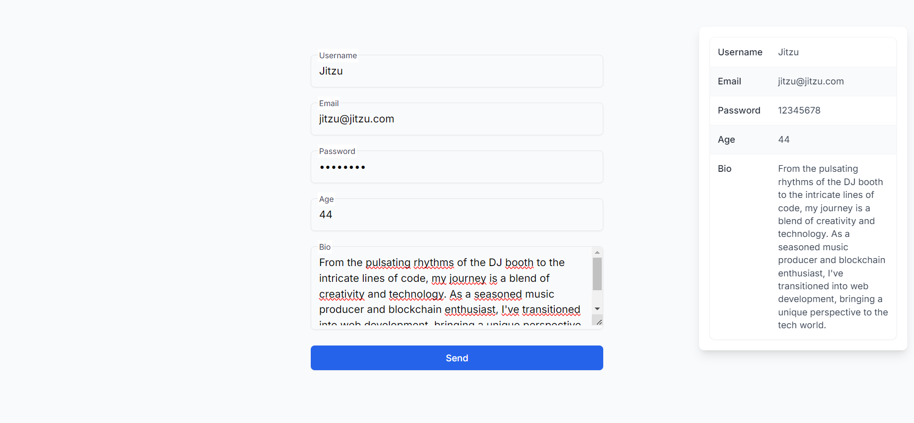

# Form Validation with Next.js, TypeScript, and Tailwind CSS

This project is a simple form validation example built using **Next.js** with **TypeScript** and **Tailwind CSS**. The form ensures that all fields are filled in correctly before submission and displays a summary of the entered data in a fixed card at the top-right corner of the viewport after submission.



## Features

- **Form Validation**: All fields must be filled out. If any field is left empty, an error message will be displayed below the respective input.
- **Dynamic Error Messaging**: Custom error messages are generated for each field based on its name.
- **Real-time Feedback**: Error messages disappear as the user starts typing in the corresponding field.
- **Summary Display**: After successful form submission, a fixed card displays the entered data.

### Usage

- Fill out all the form fields: **Username**, **Email**, **Password**, **Age**, and **Bio**.
- If you leave any field empty, an error message will appear below that field, prompting you to enter valid data.
- Once all fields are correctly filled, click the **Send** button.
- A summary of your entered data will appear in a fixed card at the top-right corner of the screen.

### Code Explanation

```ts
"use client";

import { useState } from "react";

interface FormData {
  username: string;
  email: string;
  password: string;
  age: string;
  bio: string;
}

export default function Home() {
  const [formData, setFormData] = useState<FormData>({
    username: "",
    email: "",
    password: "",
    age: "",
    bio: "",
  });

  const [errors, setErrors] = useState<FormData>({
    username: "",
    email: "",
    password: "",
    age: "",
    bio: "",
  });

  const [submitted, setSubmitted] = useState(false);

  const handleChange = (
    e: React.ChangeEvent<HTMLInputElement | HTMLTextAreaElement>
  ) => {
    setFormData({
      ...formData,
      [e.target.name]: e.target.value,
    });
    setErrors({
      ...errors,
      [e.target.name]: "", // Clear errors when the user starts typing
    });
  };

  const handleSubmit = (e: React.FormEvent) => {
    e.preventDefault();
    const newErrors: FormData = {
      username: "",
      email: "",
      password: "",
      age: "",
      bio: "",
    };

    let hasErrors = false;

    Object.entries(formData).forEach(([key, value]) => {
      if (!value) {
        hasErrors = true;
        newErrors[
          key as keyof FormData
        ] = `You must enter a valid ${key} input.`;
      }
    });

    if (hasErrors) {
      setErrors(newErrors);
      return;
    }

    setSubmitted(true);
  };

  return (
    <div className="min-h-screen bg-gray-50 flex items-center justify-center p-6">
      <div className="max-w-md w-full space-y-8">
        <form onSubmit={handleSubmit} className="space-y-6">
          {/* Username */}
          <label
            htmlFor="username"
            className="relative block rounded-md border border-gray-200 shadow-sm focus-within:border-blue-600 focus-within:ring-1 focus-within:ring-blue-600"
          >
            <input
              type="text"
              id="username"
              name="username"
              className="peer border-none bg-transparent placeholder-transparent focus:border-transparent focus:outline-none focus:ring-0 w-full p-3"
              placeholder="Username"
              value={formData.username}
              onChange={handleChange}
            />
            <span className="pointer-events-none absolute left-2.5 top-0 -translate-y-1/2 bg-white p-0.5 text-xs text-gray-700 transition-all peer-placeholder-shown:top-1/2 peer-placeholder-shown:text-sm peer-focus:top-0 peer-focus:text-xs">
              Username
            </span>
          </label>
          {errors.username && (
            <p className="text-red-600 text-sm mt-1">{errors.username}</p>
          )}

          {/* Email */}
          <label
            htmlFor="email"
            className="relative block rounded-md border border-gray-200 shadow-sm focus-within:border-blue-600 focus-within:ring-1 focus-within:ring-blue-600"
          >
            <input
              type="email"
              id="email"
              name="email"
              className="peer border-none bg-transparent placeholder-transparent focus:border-transparent focus:outline-none focus:ring-0 w-full p-3"
              placeholder="Email"
              value={formData.email}
              onChange={handleChange}
            />
            <span className="pointer-events-none absolute left-2.5 top-0 -translate-y-1/2 bg-white p-0.5 text-xs text-gray-700 transition-all peer-placeholder-shown:top-1/2 peer-placeholder-shown:text-sm peer-focus:top-0 peer-focus:text-xs">
              Email
            </span>
          </label>
          {errors.email && (
            <p className="text-red-600 text-sm mt-1">{errors.email}</p>
          )}

          {/* Password */}
          <label
            htmlFor="password"
            className="relative block rounded-md border border-gray-200 shadow-sm focus-within:border-blue-600 focus-within:ring-1 focus-within:ring-blue-600"
          >
            <input
              type="password"
              id="password"
              name="password"
              className="peer border-none bg-transparent placeholder-transparent focus:border-transparent focus:outline-none focus:ring-0 w-full p-3"
              placeholder="Password"
              value={formData.password}
              onChange={handleChange}
            />
            <span className="pointer-events-none absolute left-2.5 top-0 -translate-y-1/2 bg-white p-0.5 text-xs text-gray-700 transition-all peer-placeholder-shown:top-1/2 peer-placeholder-shown:text-sm peer-focus:top-0 peer-focus:text-xs">
              Password
            </span>
          </label>
          {errors.password && (
            <p className="text-red-600 text-sm mt-1">{errors.password}</p>
          )}

          {/* Age */}
          <label
            htmlFor="age"
            className="relative block rounded-md border border-gray-200 shadow-sm focus-within:border-blue-600 focus-within:ring-1 focus-within:ring-blue-600"
          >
            <input
              type="number"
              id="age"
              name="age"
              className="peer border-none bg-transparent placeholder-transparent focus:border-transparent focus:outline-none focus:ring-0 w-full p-3"
              placeholder="Age"
              value={formData.age}
              onChange={handleChange}
            />
            <span className="pointer-events-none absolute left-2.5 top-0 -translate-y-1/2 bg-white p-0.5 text-xs text-gray-700 transition-all peer-placeholder-shown:top-1/2 peer-placeholder-shown:text-sm peer-focus:top-0 peer-focus:text-xs">
              Age
            </span>
          </label>
          {errors.age && (
            <p className="text-red-600 text-sm mt-1">{errors.age}</p>
          )}

          {/* Bio */}
          <label
            htmlFor="bio"
            className="relative block rounded-md border border-gray-200 shadow-sm focus-within:border-blue-600 focus-within:ring-1 focus-within:ring-blue-600"
          >
            <textarea
              id="bio"
              name="bio"
              className="peer border-none bg-transparent placeholder-transparent focus:border-transparent focus:outline-none focus:ring-0 w-full p-3"
              placeholder="Bio"
              rows={4}
              value={formData.bio}
              onChange={handleChange}
            />
            <span className="pointer-events-none absolute left-2.5 top-0 -translate-y-1/2 bg-white p-0.5 text-xs text-gray-700 transition-all peer-placeholder-shown:top-1/2 peer-placeholder-shown:text-sm peer-focus:top-0 peer-focus:text-xs">
              Bio
            </span>
          </label>
          {errors.bio && (
            <p className="text-red-600 text-sm mt-1">{errors.bio}</p>
          )}

          <button
            type="submit"
            className="w-full flex justify-center py-2 px-4 border border-transparent rounded-md shadow-sm text-sm font-medium text-white bg-blue-600 hover:bg-blue-700 focus:outline-none focus:ring-2 focus:ring-offset-2 focus:ring-blue-500"
          >
            Send
          </button>
        </form>

        {submitted && (
          <div className="fixed top-4 right-4 w-80 p-4 bg-white rounded-lg shadow-lg border border-gray-100">
            <div className="flow-root rounded-lg border border-gray-100 py-3 shadow-sm">
              <dl className="-my-3 divide-y divide-gray-100 text-sm">
                <div className="grid grid-cols-1 gap-1 p-3 even:bg-gray-50 sm:grid-cols-3 sm:gap-4">
                  <dt className="font-medium text-gray-900">Username</dt>
                  <dd className="text-gray-700 sm:col-span-2">
                    {formData.username}
                  </dd>
                </div>
                <div className="grid grid-cols-1 gap-1 p-3 even:bg-gray-50 sm:grid-cols-3 sm:gap-4">
                  <dt className="font-medium text-gray-900">Email</dt>
                  <dd className="text-gray-700 sm:col-span-2">
                    {formData.email}
                  </dd>
                </div>
                <div className="grid grid-cols-1 gap-1 p-3 even:bg-gray-50 sm:grid-cols-3 sm:gap-4">
                  <dt className="font-medium text-gray-900">Password</dt>
                  <dd className="text-gray-700 sm:col-span-2">
                    {formData.password}
                  </dd>
                </div>
                <div className="grid grid-cols-1 gap-1 p-3 even:bg-gray-50 sm:grid-cols-3 sm:gap-4">
                  <dt className="font-medium text-gray-900">Age</dt>
                  <dd className="text-gray-700 sm:col-span-2">
                    {formData.age}
                  </dd>
                </div>
                <div className="grid grid-cols-1 gap-1 p-3 even:bg-gray-50 sm:grid-cols-3 sm:gap-4">
                  <dt className="font-medium text-gray-900">Bio</dt>
                  <dd className="text-gray-700 sm:col-span-2">
                    {formData.bio}
                  </dd>
                </div>
              </dl>
            </div>
          </div>
        )}
      </div>
    </div>
  );
}
```

1. **Component Export**: The component is defined as a function named `Home` and is exported as the default export.
2. **State Management**:
   - `useState` is used to manage form data (`formData`), error states (`errors`), and submission state (`submitted`).
   - `formData` holds the values entered in the form fields.
   - `errors` holds error messages for each field.
   - `submitted` determines whether the form has been submitted.
3. **Handling Input Changes**:
   - The `handleChange` function updates the corresponding field in `formData` and clears any error message for that field.
4. **Form Submission**:
   - The `handleSubmit` function validates the form data on submission, checks for errors, and sets the `submitted` state to `true` if validation passes.
5. **Form Rendering**:
   - The form includes input fields for each piece of data. Error messages are conditionally displayed below the respective fields.
6. **Submission Button**:
   - The **Send** button triggers the `handleSubmit` function, which validates and processes the form data.
7. **Summary Display**:
   - Upon successful form submission, a card containing the submitted data is displayed at the top-right corner of the screen.

## Tailwind CSS and Next.js Configuration

- This project uses the `@tailwindcss/forms` plugin to style the form inputs.
- Next.js is set up with TypeScript for type safety and Tailwind CSS for styling.

## Acknowledgments

Thanks to the Next.js and Tailwind CSS communities for their excellent documentation and resources.
